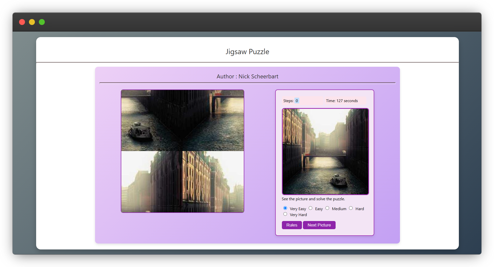

# Jigsaw Puzzle Game with Lorem Picsum Images

This project is a simple jigsaw puzzle game that fetches random images from the Lorem Picsum API and creates a puzzle using these images.

## Features

- **Random Images**: Fetches images from the Lorem Picsum API to create a variety of puzzles.
- **Adjustable Grid Size**: Choose the difficulty level by adjusting the grid size of the puzzle.
- **Interactive Interface**: Drag and drop puzzle pieces to solve the puzzle.
- **Timer and Step Count**: Tracks time spent and the number of moves made to solve the puzzle.

## Usage

1. Clone the repository to your local machine.
2. Open the `index.html` file in a web browser.
3. The game will start with a default image fetched from the Lorem Picsum API.
4. Choose the difficulty level by selecting the grid size.
5. Solve the puzzle by dragging and dropping the pieces into the correct position.
6. Use the "Next Picture" button to get a new image from Lorem Picsum and restart the game.

## Technologies Used

- HTML
- CSS
- JavaScript
- jQuery

## Credits

- [Lorem Picsum](https://picsum.photos/) - For providing random placeholder images.
  
## Demo

## Contributing

Contributions are welcome! Please open an issue or submit a pull request for any new features or improvements.
